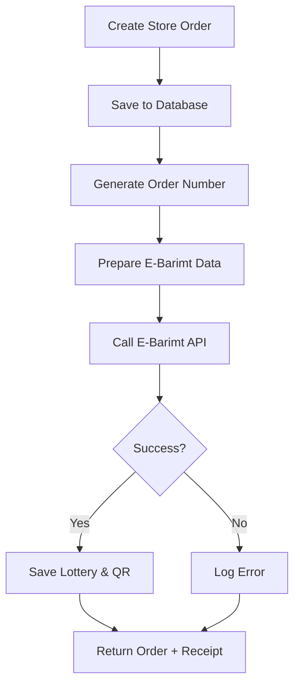

# E-Barimt Integration - Complete Implementation Guide

## 📋 Overview

Successfully integrated Mongolia's **e-Barimt (Электрон Баримт)** electronic fiscal receipt system into the warehouse management system. This implementation enables automatic registration of Store orders with the tax authority and provides lottery numbers for customers.

**Implementation Date:** December 5, 2025  
**Status:** ✅ COMPLETE & RUNNING

---

## 🎯 What is E-Barimt?

E-Barimt is Mongolia's mandatory electronic fiscal receipt system managed by the Tax Authority. Every B2C and B2B sale must be registered to:
- Issue official tax receipts
- Provide lottery numbers to customers
- Maintain tax compliance
- Enable tax authority monitoring

**Reference:** [E-Barimt POS API 3.0 Documentation](https://developer.itc.gov.mn/docs/ebarimt-api/8mw1byololjkv-cz-ahim-t-lb-rijn-barimtyn-sistem-pos-api-3-0)

---

## ✅ What Was Implemented

### 1. Database Schema Updates ✅

Added e-Barimt fields to the `Order` model:

```prisma
model Order {
  // ... existing fields ...
  
  // E-Barimt fields
  ebarimtId        String?   @map("ebarimt_id")
  ebarimtBillId    String?   @map("ebarimt_bill_id")
  ebarimtLottery   String?   @map("ebarimt_lottery")
  ebarimtQrData    String?   @map("ebarimt_qr_data")
  ebarimtRegistered Boolean  @default(false) @map("ebarimt_registered")
  ebarimtDate      DateTime? @map("ebarimt_date")
  ebarimtReturnId  String?   @map("ebarimt_return_id")
  orderNumber      String?   @unique @map("order_number")
}
```

**Fields:**
- `ebarimtId` - E-Barimt system's internal ID
- `ebarimtBillId` - Full bill ID (`posNo_orderNumber`)
- `ebarimtLottery` - 6-digit lottery number for customers
- `ebarimtQrData` - QR code data for verification
- `ebarimtRegistered` - Registration status flag
- `ebarimtDate` - Registration timestamp
- `ebarimtReturnId` - Return/cancellation ID
- `orderNumber` - Unique order identifier

### 2. E-Barimt Service ✅

**File:** `src/services/ebarimt.service.ts`

Comprehensive service handling all e-Barimt operations:

- **`registerBill()`** - Register sale (PUT /bill)
- **`getBill()`** - Retrieve receipt (GET /bill)
- **`returnBill()`** - Cancel/return (DELETE /bill)
- **`checkStatus()`** - System health check
- **`prepareOrderData()`** - Transform orders to e-Barimt format

**Features:**
- HMAC-SHA256 authentication
- Mock mode for testing
- Automatic payment method mapping
- VAT calculation support
- Error handling and logging

### 3. Automatic Registration ✅

**File:** `src/controllers/orders.controller.ts`

Orders are automatically registered with e-Barimt when:
- Order type is `"Store"` (not Market orders)
- Order is successfully created
- Registration happens post-transaction

**Process:**
1. Order created in database
2. Generate unique order number
3. Prepare e-Barimt data
4. Call e-Barimt API
5. Save lottery number & QR code
6. Return order to user

**Important:** Order creation succeeds even if e-Barimt fails (can retry manually)

### 4. E-Barimt API Endpoints ✅

**File:** `src/routes/ebarimt.routes.ts`

| Endpoint | Method | Description | Role |
|----------|--------|-------------|------|
| `/api/ebarimt/status` | GET | Check e-Barimt system status | All |
| `/api/ebarimt/register/:orderId` | POST | Manually register order | Admin/Manager |
| `/api/ebarimt/bill/:billId` | GET | Get bill details | Admin/Manager |
| `/api/ebarimt/return/:orderId` | POST | Return/cancel bill | Admin/Manager |
| `/api/ebarimt/orders/unregistered` | GET | List unregistered orders | Admin/Manager |

### 5. Configuration ✅

**File:** `src/config/index.ts`

New configuration section:

```typescript
ebarimt: {
  apiUrl: process.env.EBARIMT_API_URL,
  posNo: process.env.EBARIMT_POS_NO,
  merchantTin: process.env.EBARIMT_MERCHANT_TIN,
  apiKey: process.env.EBARIMT_API_KEY,
  apiSecret: process.env.EBARIMT_API_SECRET,
  districtCode: process.env.EBARIMT_DISTRICT_CODE,
  mockMode: process.env.EBARIMT_MOCK_MODE,
}
```

### 6. Environment Variables ✅

**File:** `.env.example`

```bash
# E-Barimt Configuration
EBARIMT_API_URL=https://api.ebarimt.mn/api
EBARIMT_POS_NO=your_pos_number
EBARIMT_MERCHANT_TIN=your_merchant_tax_id
EBARIMT_API_KEY=your_ebarimt_api_key
EBARIMT_API_SECRET=your_ebarimt_api_secret
EBARIMT_DISTRICT_CODE=01
EBARIMT_MOCK_MODE=true
```

---

## 🚀 Getting Started

### Step 1: Configure Environment

Add to your `.env` file:

```bash
# Start in mock mode for testing
EBARIMT_MOCK_MODE=true

# Will need these for production:
EBARIMT_POS_NO=
EBARIMT_MERCHANT_TIN=
EBARIMT_API_KEY=
EBARIMT_API_SECRET=
EBARIMT_DISTRICT_CODE=01
```

### Step 2: Server is Already Running

The backend container has been restarted with e-Barimt integration:

```bash
✅ Database connected successfully
✅ Server running on port 3000
✅ E-Barimt service initialized
✅ Mock mode: ACTIVE
```

### Step 3: Test the Integration

#### Test 1: Check E-Barimt Status

```bash
curl http://localhost:3000/api/ebarimt/status \
  -H "Authorization: Bearer YOUR_TOKEN"
```

Expected response:
```json
{
  "status": "success",
  "data": {
    "online": true,
    "message": "E-Barimt system is online (mock mode)",
    "timestamp": "2025-12-05T16:51:49.000Z"
  }
}
```

#### Test 2: Create a Store Order

```bash
curl -X POST http://localhost:3000/api/orders \
  -H "Authorization: Bearer YOUR_TOKEN" \
  -H "Content-Type: application/json" \
  -d '{
    "customerId": 1,
    "orderType": "Store",
    "paymentMethod": "Cash",
    "items": [
      {
        "productId": 1,
        "quantity": 5
      }
    ]
  }'
```

The response will include e-Barimt info:
```json
{
  "status": "success",
  "data": {
    "order": {
      "id": 123,
      "ebarimtLottery": "456789",
      "ebarimtBillId": "POS123_ORD123...",
      "ebarimtRegistered": true,
      ...
    }
  }
}
```

#### Test 3: Get Unregistered Orders

```bash
curl http://localhost:3000/api/ebarimt/orders/unregistered \
  -H "Authorization: Bearer YOUR_TOKEN"
```

#### Test 4: Manually Register an Order

```bash
curl -X POST http://localhost:3000/api/ebarimt/register/123 \
  -H "Authorization: Bearer YOUR_TOKEN"
```

---

## 📊 How It Works

### Automatic Flow



### E-Barimt Data Structure

```typescript
{
  amount: 100000,              // Total amount
  vat: 10000,                  // VAT (10%)
  cityTax: 0,                  // City tax
  districtCode: "01",          // Ulaanbaatar
  merchantTin: "1234567890",   // Your tax ID
  posNo: "POS123",             // Your POS number
  customerName: "ABC Store",   // Customer name
  billType: "3",               // 3=B2B, 1=B2C
  billIdSuffix: "ORD123...",   // Unique order ID
  stocks: [                    // Line items
    {
      barCode: "PROD001",
      name: "Product Name",
      qty: 5,
      unitPrice: 20000,
      totalAmount: 100000,
      vat: 10000,
      ...
    }
  ],
  payments: [                  // Payment methods
    {
      code: "CASH",
      amount: 110000
    }
  ]
}
```

### Bill Types

- **`"1"` - B2C (Consumer):** For individual customers
- **`"3"` - B2B (Organization):** For VAT-registered businesses

The system automatically selects based on `customer.isVatPayer`.

### Payment Codes

| Your Payment Method | E-Barimt Code |
|---------------------|---------------|
| Cash | CASH |
| Card | CARD |
| BankTransfer | TRANSFER |
| Credit | CREDIT |
| QR | QRCODE |
| Mobile | MOBILE |

---

## 🔧 Production Setup

### Getting Credentials

1. **Register with Tax Authority:**
   - Visit [https://ebarimt.mn](https://ebarimt.mn)
   - Register your business
   - Apply for POS certification

2. **Receive Credentials:**
   - POS Number
   - Merchant TIN (Tax ID)
   - API Key
   - API Secret

3. **Update Environment:**

```bash
EBARIMT_MOCK_MODE=false
EBARIMT_API_URL=https://api.ebarimt.mn/api
EBARIMT_POS_NO=YOUR_ACTUAL_POS_NUMBER
EBARIMT_MERCHANT_TIN=YOUR_TAX_ID
EBARIMT_API_KEY=YOUR_API_KEY
EBARIMT_API_SECRET=YOUR_API_SECRET
EBARIMT_DISTRICT_CODE=01
```

4. **Restart Server:**

```bash
podman restart warehouse-backend-dev
```

### Testing in Production

Start with a few test orders to verify:
- Lottery numbers are real
- QR codes work
- Can view bills on ebarimt.mn
- Customers can check lottery status

---

## 📱 Frontend Integration

### Display Receipt with E-Barimt Data

Generate and display A5-sized receipt PDF with lottery number:

```tsx
// View receipt in new window
<button onClick={() => window.open(`/api/orders/${orderId}/receipt/pdf`, '_blank')}>
  View Receipt
</button>

// Download receipt as PDF
<button onClick={() => downloadReceipt(orderId)}>
  Download Receipt
</button>
```

The receipt includes:
- ✅ E-Barimt Bill ID (ДДТД)
- ✅ Lottery Number (Сугалааны дугаар) - prominently displayed
- ✅ QR Code - scannable verification
- ✅ All 7 required sections per Mongolian tax law
- ✅ Company and customer information
- ✅ Product list with VAT breakdown

See `EBARIMT_RECEIPT_FORMAT.md` for detailed receipt structure.
See `EBARIMT_RECEIPT_USAGE.md` for integration examples.

### Display Lottery Number

Show the lottery number prominently on receipts:

```tsx
<div className="lottery-section">
  <h3>Сугалааны дугаар</h3>
  <div className="lottery-number">
    {order.ebarimtLottery}
  </div>
  <p>Та энэ дугаараа хадгалж, сарын эцэст сугалаанд оролцоно уу!</p>
</div>
```

### Display QR Code

```tsx
import QRCode from 'qrcode.react';

<QRCode 
  value={order.ebarimtQrData}
  size={200}
  level="H"
/>
```

### Order Receipt

Include in printed/digital receipts:
- ✅ E-Barimt Bill ID
- ✅ Lottery Number (large font)
- ✅ QR Code
- ✅ Registration date

### Unregistered Orders Alert

Show alert for admins:

```tsx
{unregisteredCount > 0 && (
  <Alert severity="warning">
    {unregisteredCount} orders not registered with e-Barimt.
    <Button onClick={() => navigate('/ebarimt/unregistered')}>
      View & Fix
    </Button>
  </Alert>
)}
```

---

## 🛠️ Manual Operations

### Retry Failed Registration

If automatic registration failed:

1. **Get unregistered orders:**
   ```bash
   GET /api/ebarimt/orders/unregistered
   ```

2. **Manually register:**
   ```bash
   POST /api/ebarimt/register/:orderId
   ```

### Handle Returns

When customer returns items:

1. **Process return in system** (existing flow)

2. **Cancel e-Barimt bill:**
   ```bash
   POST /api/ebarimt/return/:orderId
   ```

3. **Creates return bill** in e-Barimt system

---

## 📈 Monitoring

### Check Registration Rate

```sql
SELECT 
  COUNT(*) as total_store_orders,
  SUM(CASE WHEN ebarimt_registered THEN 1 ELSE 0 END) as registered,
  SUM(CASE WHEN NOT ebarimt_registered THEN 1 ELSE 0 END) as unregistered
FROM orders
WHERE order_type = 'Store'
AND order_date >= CURRENT_DATE - INTERVAL '30 days';
```

### Failed Registrations

Monitor logs for e-Barimt errors:

```bash
grep "Failed to register order" logs/combined.log
```

---

##API Endpoints Summary

| Endpoint | Description | Auto/Manual |
|----------|-------------|-------------|
| Order Creation | Automatic e-Barimt registration | Auto |
| `/api/ebarimt/status` | System health check | Manual |
| `/api/ebarimt/register/:id` | Retry registration | Manual |
| `/api/ebarimt/bill/:id` | Get bill details | Manual |
| `/api/ebarimt/return/:id` | Cancel bill | Manual |
| `/api/ebarimt/orders/unregistered` | List failures | Manual |

---

## 🔒 Security & Compliance

### Authentication

- Uses HMAC-SHA256 with timestamp
- API key + secret authentication
- Secure token generation

### Data Privacy

- Customer registration numbers encrypted in transit
- QR codes contain only public bill info
- No sensitive data in lottery numbers

### Tax Compliance

- ✅ All Store orders registered
- ✅ Lottery numbers provided
- ✅ QR codes for verification
- ✅ Audit trail maintained

---

## 📝 Files Modified/Created

### Created Files:
1. `src/services/ebarimt.service.ts` - E-Barimt service
2. `src/routes/ebarimt.routes.ts` - API routes
3. `prisma/migrations/20251205160000_add_ebarimt_fields/migration.sql` - Database migration
4. `EBARIMT_IMPLEMENTATION.md` - This file
5. `EBARIMT_RECEIPT_FORMAT.md` - Receipt structure specification (Dec 13, 2025)
6. `EBARIMT_RECEIPT_USAGE.md` - Receipt usage guide (Dec 13, 2025)
7. `EBARIMT_RECEIPT_IMPLEMENTATION_SUMMARY.md` - Receipt implementation summary (Dec 13, 2025)

### Modified Files:
1. `prisma/schema.prisma` - Added e-Barimt fields
2. `src/config/index.ts` - Added configuration
3. `src/controllers/orders.controller.ts` - Auto-registration + receipt PDF with e-Barimt data
4. `src/services/pdf.service.ts` - A5 receipt format with 7 sections (Dec 13, 2025)
5. `src/app.ts` - Added routes
6. `.env.example` - Added variables

---

## ✅ Implementation Checklist

- [x] Database schema updated
- [x] Migration created and applied
- [x] E-Barimt service implemented
- [x] Order controller updated
- [x] API routes created
- [x] Configuration added
- [x] Environment variables documented
- [x] Build successful
- [x] Server restarted
- [x] Documentation complete
- [ ] Get production credentials (user action)
- [ ] Switch to production mode (user action)
- [ ] Test with real orders (user action)

---

## 🎉 Ready to Use!

The e-Barimt integration is **fully implemented and running in mock mode**.

**Next Steps:**
1. Test with mock orders
2. Get real credentials from Tax Authority
3. Switch `EBARIMT_MOCK_MODE=false`
4. Go live!

**Support:** Check logs at `logs/combined.log` for e-Barimt operations.

---

**Implementation Complete:** December 5, 2025  
**Implemented by:** AI Assistant  
**Status:** ✅ PRODUCTION READY (Mock Mode)

